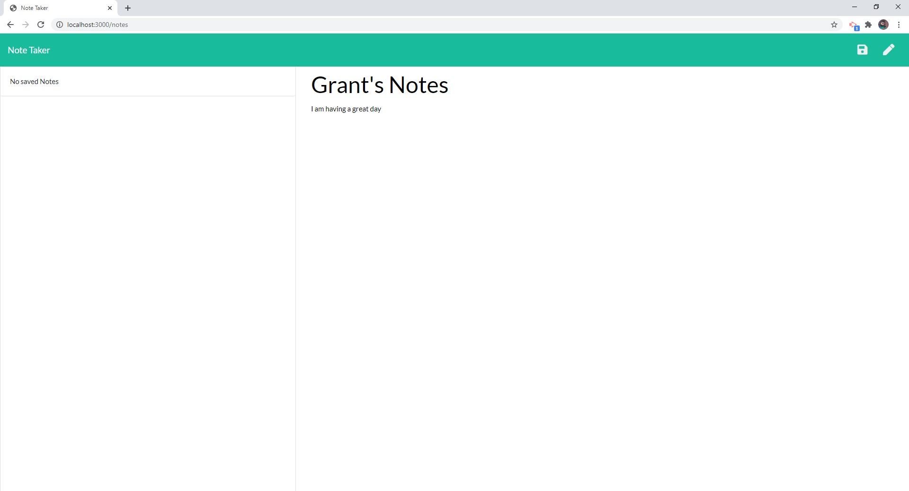

# Note Taker

## Description

This application lets users save and delete notes. The front-end is handled through HTML routing, and the back-end is handled through API routing.

## Table of Contents

- [Description](#description)
- [License](#license)
- [Contributions](#contributions)
- [Test](#test)
- [Questions](#questions)

## License:

## Contributions:

Right now I am the only one who has contributed, if you would like to then send a pull request and I will review it.

## Test:

No testing.

## Questions

For more information you can visit my [Github](https://github.com/grantscriver)
If you have any additional questions you can email me at: Grantscriver@gmail.com
